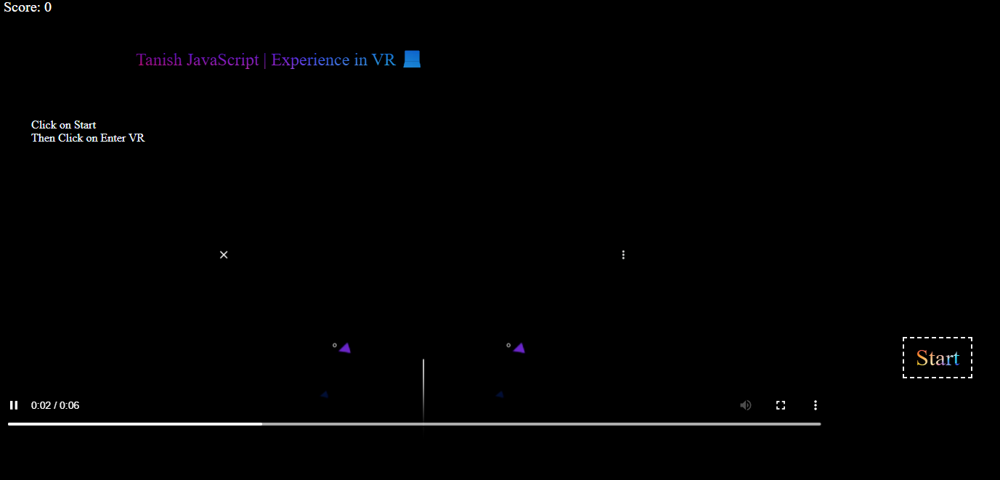
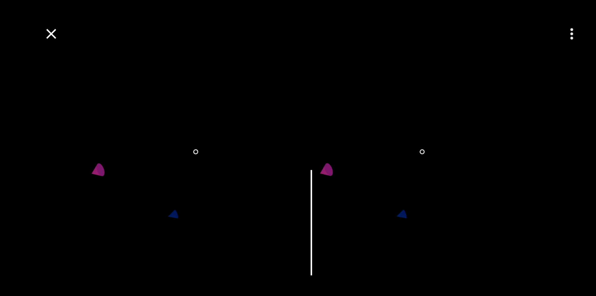

# 🕶️ VR Game

> Step into the experience.

An interactive browser-based VR game that delivers an immersive experience using modern web technologies, combining real-time interaction, dynamic UI, and engaging gameplay.

---

## 🚀 Live Demo

👉 https://tanishvrgame.netlify.app/

---

## 🎯 Overview

VR Game is a web-based immersive experience designed to simulate a virtual environment directly in the browser. The project focuses on interactivity, responsiveness, and user engagement through real-time rendering and intuitive controls.

---

## ✨ Features

* 🕶️ Immersive VR-style experience
* 🎮 Interactive gameplay elements
* ⚡ Real-time user interaction
* 🎨 Visually engaging UI
* 📱 Responsive design
* 🚀 Lightweight and fast

---

## 🧠 What This Project Demonstrates

* Real-time interaction handling
* Advanced DOM and event management
* 3D/interactive UI concepts
* Performance optimization for smooth experience
* User-centric immersive design

---

## 🛠 Tech Stack

* **HTML5**
* **CSS3**
* **JavaScript**
* **Three.js / WebGL**

---

## 📂 Project Structure

```text
vr-game/
│
├── index.html
├── screenshots/
│
├── README.md
├── .gitignore
└── LICENSE
```

---

## ⚙️ Run Locally

1. Clone the repository:

```bash
git clone https://github.com/agrawalTanish/tanish-vr-game.git
```

2. Open the project folder

3. Open `index.html` in your browser

---

## 📸 Screenshots





## 🌐 Deployment

Deployed using **Netlify**

👉 https://tanishvrgame.netlify.app/

---

## 🔮 Future Improvements

* 🕶️ Full WebXR support
* 🎮 Advanced game mechanics
* 🔊 Spatial audio integration
* 🧠 AI-driven interactions
* 🌍 Multiplayer support

---

## 💡 Inspiration

Inspired by modern VR environments and immersive web experiences, aiming to bring interactive 3D experiences directly to the browser.

---

## 👨‍💻 Author

**Tanish Agrawal**

---

## 📄 License

This project is licensed under the MIT License.
